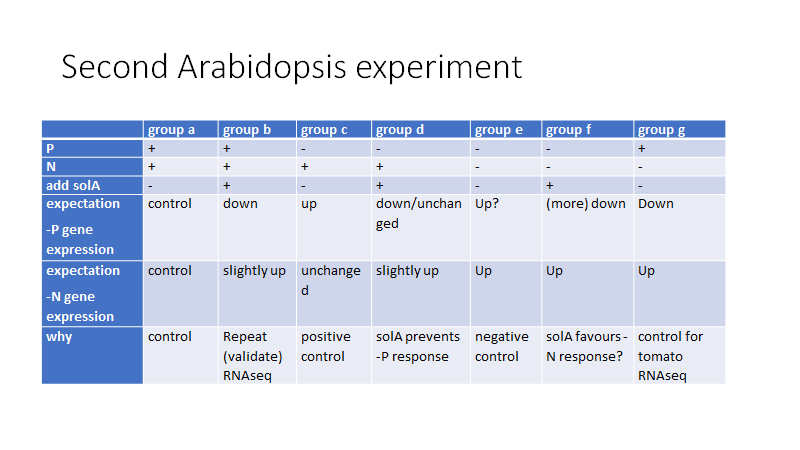

# Introduction
In this file the complete analysis workflow of count data of the Arabidopsis RNAseq experiment is shown.

## Goal

The goal of this experiment is to unravel the effect of solanoeclepin A on the plant. Solanoeclepin A is applied on Arabidopsis seedlings under various nutritional conditions. The set up of this experiment is summarized in this figure:
```{r include = FALSE}
if ("knitr" %in% installed.packages()){
  library("knitr")
} else {
  install.packages("knitr")
  library("knitr")
}
```
```{r setup, include = FALSE}
knitr::opts_knit$set(root.dir = rprojroot::find_rstudio_root_file())
```

```{r figurename, echo=FALSE, out.width = '90%'}

```

## Setup

Packages necessary:

* Checkpoint
* DESeq2
* dplyr
* tidyr
* tidyverse
* Biostrings
* biomaRt
* biomartr
* clusterProfiler
* org.At.tair.db
* tibble
* mixOmics
* vegan
* apeglm
* EnhancedVolcano
* patchwork

```{r include=FALSE}
#########
# Library
#########
if ("checkpoint" %in% installed.packages()){
  library("checkpoint") # https://cran.r-project.org/web/packages/checkpoint/index.html
} else {
  install.packages("checkpoint")
  suppressPackageStartupMessages(library("checkpoint"))
  suppressPackageStartupMessages(checkpoint("2021-04-20"))  # all packages in your project will be taken from that date.
}
if ("DESeq2" %in% installed.packages()){
  library("DESeq2")
} else {
  BiocManager::install("DESeq2")
  library("DESeq2")
}
if ("dplyr" %in% installed.packages()){
  library("dplyr")
} else {
  install.packages("dplyr")
  library("dplyr")
}
if ("tidyr" %in% installed.packages()){
  library("tidyr")
} else {
  install.packages("tidyr")
  library("tidyr")
}
if ("tidyverse" %in% installed.packages()){
  library("tidyverse")
} else {
  install.packages("tidyverse")
  library("tidyverse")
}
if ("Biostrings" %in% installed.packages()){
  library("Biostrings") 
} else {
  BiocManager::install("Biostrings")
  library("Biostrings")
}
if ("biomaRt" %in% installed.packages()){
  library("biomaRt") 
} else {
  BiocManager::install("biomaRt")
  library("biomaRt")
}
if ("biomartr" %in% installed.packages()){
  library("biomartr")
} else {
  install.packages("biomartr", dependencies = TRUE)
  library("biomartr")
}
if ("clusterProfiler" %in% installed.packages()){
  library("clusterProfiler") 
} else {
  BiocManager::install("clusterProfiler")
  library("clusterProfiler")
}
if ("org.At.tair.db" %in% installed.packages()){
  library("org.At.tair.db") 
} else {
  BiocManager::install("org.At.tair.db")
  library("org.At.tair.db")
}
if ("tibble" %in% installed.packages()){
  library("tibble") 
} else {
  install.packages("tibble")
  library("tibble")
}
if ("mixOmics" %in% installed.packages()){
  library("mixOmics") 
} else {
  BiocManager::install("mixOmics")
  library("mixOmics")
}
if ("vegan" %in% installed.packages()){
  library("vegan") 
} else {
  install.packages("vegan")
  library("vegan")
}
if ("apeglm" %in% installed.packages()){
  library("apeglm") 
} else {
  BiocManager::install("apeglm")
  library("apeglm")
}
if ("EnhancedVolcano" %in% installed.packages()){
  library("EnhancedVolcano") 
} else {
  BiocManager::install("EnhancedVolcano")
  library("EnhancedVolcano")
}
if ("patchwork" %in% installed.packages()){
  library("patchwork") 
} else {
  BiocManager::install("patchwork")
  library("patchwork")
}
if ("reshape" %in% installed.packages()){
  library("reshape") 
} else {
  install.packages("reshape")
  library("reshape")
}
if ("pheatmap" %in% installed.packages()){
  library("pheatmap") 
} else {
  BiocManager::install("pheatmap")
  library("pheatmap")
}
```


# Mapping results

Calculate the average unique mapping %:

```{r}
ms <- read.csv("Ath2/input/mapping_summary.csv")
ms <- ms[, -1] %>% column_to_rownames("attribute")
ms[1:10,1:3]
```

```{r include = FALSE}
unique <- ms[9,]
unique <- as.list(unique)
unique <- gsub("%", "", unique)
unique <- as.numeric(unique)
uniquepercent <- mean(unique)
```
```{r}
uniquepercent
```

The average unique mapping % is 62.67%. This is low, but explained by the type of library prep method that was used (Moll et al, 2014).


# PCA analysis

Load the function:
```{r}
source("Ath2/scripts/create_pca_plot.R")
```

Run the function with default settings, which is
```{r, eval = FALSE}
plot_pca <- function(count_csv_file = "Ath2/input/counts.csv",
                     xp_design_csv_file = "~Ath2/input/xp_design.csv",
                     pc_x_axis = "PC1", 
                     pc_y_axis = "PC2",
                     trm = c("a","b","c","d","e","f","g"),
                     pca_colour = "solA")
```

```{r}
plot_pca()
```

In order to make an overview of what determines the clustering, make the same plot with different colour guides and group them together with patchwork package
```{r}
p1 <- plot_pca(pca_colour = "treatment")
p2 <- plot_pca()
p3 <- plot_pca(pca_colour = "N")
p4 <- plot_pca(pca_colour = "P")

(p1 | p2) / (p3 | p4)
```

From this figure, it is clear that the most variation is explained by the N condition. This figure is saved as PCAplot_PC1PC2_allsamples.jpeg.

There is no good separation based on treatment or solA supply. Therefore, check also PC3 and PC4
```{r}
p1 <- plot_pca(pc_x_axis = "PC3", pc_y_axis = "PC4", pca_colour = "treatment")
p2 <- plot_pca(pc_x_axis = "PC3", pc_y_axis = "PC4")
p3 <- plot_pca(pc_x_axis = "PC3", pc_y_axis = "PC4", pca_colour = "N")
p4 <- plot_pca(pc_x_axis = "PC3", pc_y_axis = "PC4", pca_colour = "P")

(p1 | p2) / (p3 | p4)
```

This figure is saved as PCAplot_PC3PC4_allsamples.jpeg

Check the screeplot of all the treatments.

```{r}
source("Ath2/scripts/scree_plot.R")
plot_scree()
```

Check the histograms of count variability per sample before and after filtering:

```{r}
source("Ath2/scripts/produce_scaled_counts_matrix.R")
scaled_counts <- produce_scaled_counts_matrix()

source("Ath2/scripts/filter_counts_based_on_treatment.R")
f <- filter_counts_based_on_treatment()
ft <- f %>% t() %>% as.data.frame() %>% gather ()
ggplot(ft, aes(value)) + 
  geom_histogram(bins = 10) + 
  facet_wrap(~key, scales = 'free_x') +
  scale_y_log10()

f_no_0 <- f[vapply(f, 
                   function(z) length(unique(z)) > 1,
                   logical(1L))] %>% data.matrix(., rownames.force = T)

median_all_genes <- median(f_no_0)
median_per_gene <- apply(f_no_0, 2, median)
f_no_0_t <- f_no_0 %>% t() %>% as.data.frame()
f_f <- f_no_0_t %>% filter(median_per_gene > median_all_genes) %>% t() %>% as.data.frame()

f_ft <- f_f %>% t() %>% as.data.frame() %>% gather()
head(f_ft)
ggplot(f_ft, aes(value)) + 
  geom_histogram(bins = 10) + 
  facet_wrap(~key, scales = 'free_x') +
  scale_y_log10() 

```

These two histograms are saved as histogram_counts_beforefilter.jpeg and histogram_counts_afterfilter.jpeg.

However, this experiment is based on pair-wise comparisons. We have different nutritional conditions (no starvation, only P starvation, N+P starvation) and within these conditions we compare the effect of adding solA. There could be an effect of solA in one condition, but not in the others. Therefore, it makes sense to look whether samples within conditions cluster based on solA treatment.
```{r}
p1 <- plot_pca(pc_x_axis = "PC3", pc_y_axis = "PC4", trm = c("a","b")) + ggtitle("No starvation")
p2 <- plot_pca(pc_x_axis = "PC3", pc_y_axis = "PC4", trm = c("c","d")) + ggtitle("Only P starvation")
p3 <- plot_pca(trm = c("e","f")) + ggtitle("N+P starvation")

p1 + p2 + p3 + plot_layout(ncol = 2)
```

This plot was saved as PCAplots_showing_clustering_solA.jpeg
In these plots, the clustering based on solA treatment is better. Especially for N+P starvation, where the clustering is visible on the axis of PC2.

Check scree plot of all nutritional conditions.
```{r}
p1 <- plot_scree(trm = c("a","b")) + ggtitle("No starvation")
p2 <- plot_scree(trm = c("c","d")) + ggtitle("Only P starvation")
p3 <- plot_scree(trm = c("e","f")) + ggtitle("N+P starvation")

p1 + p2 + p3 + plot_layout(ncol = 2)
```


# DEG analysis

## Wald test

Taking into account all samples, regardless of nutritional condition, check the amount of DEGs comparing solA yes vs no. The design of the DESeq formula is set to ~ N + P + solA.
```{r}
source("Ath2/scripts/volcanoplot.R")
```
```{r, warning = FALSE, message = FALSE}
make_volcanoplot(trtm = c("a","b","c","d","e","f","g"), log2FC_threshold = 0, FCcutoff_volcano = 1, padj_threshold = 0.05, ttl = "All treatments, solA treatment, Wald", method = "solA", xsize = 2.5)
```

There are a few significant genes present.
We can try to include not only the solA factor in the model, but also the interaction with N, since this factor has a big influence on all samples.
Therefore, we set method to N:solA. The design formula now becomes ~N + P + N:solA + solA.
The resulting volcanoplot is shown here:
```{r, warning = FALSE, message = FALSE}
make_volcanoplot(trtm = c("a","b","c","d","e","f","g"), log2FC_threshold = 0, FCcutoff_volcano = 1, padj_threshold = 0.05, ttl = "All treatments, solA treatment (taking into acc N:solA), Wald", method = "N:solA+solA", xsize = 2)
```

It seems that there are no DEGs that are caused by solA alone. So, let's find out which DEGs come up if we only look at factor N:solA.
We can completely and only focus on the N:solA interaction (making the design formula ~N + P + N:solA):
```{r, warning = FALSE, message = FALSE}
make_volcanoplot(trtm = c("a","b","c","d","e","f","g"), log2FC_threshold = 0, FCcutoff_volcano = 1, padj_threshold = 0.05, ttl = "All treatments, N:solA treatment, Wald", method = "N:solA", xsize = 2)
```

Now there are a few DEGs.

But it probably makes more sense to do the comparison yes/no solA within nutritional conditions.

So, do this analysis for the within nutritional condition comparison. In this case, the design formula is set to ~ treatment (N and P are not relevant anymore - will even give an error - because you compare samples that have the same N and P).
```{r, warning = FALSE, message = FALSE}
p1 <- make_volcanoplot(log2FC_threshold = 0, FCcutoff_volcano = 1, padj_threshold = 0.05, xsize = 1.5, ttl = "No starvation, solA treatment")
p2 <- make_volcanoplot(trtm = c("c", "d"), ref_treatment = "d", treatment2 = "c", log2FC_threshold = 0, FCcutoff_volcano = 1, padj_threshold = 0.05, xsize = 1.5, ttl = "P starvation, +N, solA treatment")
p3 <- make_volcanoplot(trtm = c("e", "f"), ref_treatment = "f", treatment2 = "e", log2FC_threshold = 0, FCcutoff_volcano = 1, padj_threshold = 0.05, xsize = 1.5, ttl = "N+P starvation, solA treatment")
p1  
p2
p3
```

There are most DEGs under N+P starvation, followed by No starvation, and then only P starvation.

## Heatmaps

Another way of visualising clustering is with a heatmap.
First, we have to extract the list of DEGs, filtered for Padj<0.05. Then we take those vst_transformed counts and plot the heatmap with pheatmap. 
```{r message=FALSE, warning=FALSE}
source("Ath2/scripts/get_filtered_list_of_DEGs.R")
x <- get_list_of_DEGs(trtm = c("a","b","c","d","e","f","g"), method = "solA", log2FC_threshold = 0)
x <- x %>% rownames_to_column("genes")
source("Ath2/scripts/produce_scaled_counts_matrix.R")
y <- produce_scaled_counts_matrix() %>% column_to_rownames("sample") %>% t() %>% as.data.frame() %>% rownames_to_column("genes")
DEG_counts <- left_join(x, y, by="genes") 
DEG_counts <- DEG_counts[, -c(2,3,4,5,6,7)]
DEG_counts <- DEG_counts %>% column_to_rownames("genes")
xp_design <- xp_design %>% column_to_rownames("sample")
pheatmap(DEG_counts, 
         gaps_col = c(5,10,15,20,25,30),
         cluster_rows = TRUE,                      
         cluster_cols = FALSE, 
         show_rownames = FALSE, 
         show_colnames = TRUE,
         scale = "row",
         main = "All samples; unclustered")
pheatmap(DEG_counts,
         cluster_rows = TRUE,                      
         cluster_cols = TRUE, 
         show_rownames = FALSE, 
         show_colnames = TRUE,
         scale = "row",
         main = "All samples; clustered")
```

We add the sample information to the heatmap:
```{r}
P <- rep(c("yes","no","yes"), c(10,20,5)) 
N <- rep(c("yes","no"), c(20,15))
solA <- rep(c("no","yes","no","yes","no","yes","no"), c(5,5,5,5,5,5,5))
samples <- names(DEG_counts)
sip <- data.frame(samples, solA, N, P) %>% column_to_rownames("samples")
#remove group g
DEG_counts <- DEG_counts[, c(1:30)]
sip <- sip[c(1:30),]

clrs <- list(
  P = c(no = "deepskyblue", yes ="dodgerblue4"),
  N = c(no = "brown1", yes = "red4"),
  solA = c(no = "mediumspringgreen", yes ="seagreen4")
)

pheatmap(DEG_counts,
         gaps_col = c(10,20),
         cluster_rows = TRUE,                      
         cluster_cols = FALSE, 
         show_rownames = FALSE, 
         show_colnames = FALSE,
         scale = "row",
         annotation_col = sip,
         annotation_colors = clrs,
         legend = FALSE,
         treeheight_row = 0,
         cutree_rows = 2)

```

In the unclustered heatmap, samples are clustered according to sample group (treatment). The treatments with solA are showing an overlapping pattern versus the treatments without solA.
In the clustered heatmap, samples are clustered according to similarity in gene expression. In this heatmap it is clear that samples from group f (S46, 47, 48, 49, 50), which is N+P starvation + solA, cluster far away from the rest, including the same nutritional conditions without solA (S41 - S45). Hence, solA treatment mostly affects N+P starved plants.

We can try the same but then with only the genes that are DE according to the model ~N+P+N:solA.
```{r message=FALSE, warning=FALSE}

x <- get_list_of_DEGs(trtm = c("a","b","c","d","e","f","g"), method = "N:solA", log2FC_threshold = 0)
x <- x %>% rownames_to_column("genes")

y <- produce_scaled_counts_matrix() %>% column_to_rownames("sample") %>% t() %>% as.data.frame() %>% rownames_to_column("genes")
DEG_counts <- left_join(x, y, by="genes") 
DEG_counts <- DEG_counts[, -c(2,3,4,5,6,7)]
DEG_counts <- DEG_counts %>% column_to_rownames("genes")
xp_design <- xp_design %>% column_to_rownames("sample")

pheatmap(DEG_counts, 
         gaps_col = c(5),
         cluster_rows = TRUE,                      
         cluster_cols = FALSE, 
         show_rownames = FALSE, 
         show_colnames = TRUE,
         scale = "row",
         border_color = NA)

```
We see roughly the same pattern as in the previous heatmap (p1), but with less genes (since there were less DEGs with this model).

We can also draw the heatmaps for within nutritional conditions.
First for the 'No starvation' condition.
```{r message=FALSE, warning=FALSE}

x <- get_list_of_DEGs(trtm = c("a","b"), ref_treatment = "b", treatment2 = "a", method = "treatment", log2FC_threshold = 0)
x <- x %>% rownames_to_column("genes")
source("Ath2/scripts/filter_counts_based_on_treatment.R")
y <- filter_counts_based_on_treatment(tr = c("a","b")) %>% t() %>% as.data.frame() %>% rownames_to_column("genes")

DEG_counts <- left_join(x, y, by="genes") 
DEG_counts <- DEG_counts[, -c(2,3,4,5,6,7)]
DEG_counts <- DEG_counts %>% column_to_rownames("genes")
p <- pheatmap(DEG_counts, 
         gaps_col = 5,
         cluster_rows = TRUE,                      
         cluster_cols = FALSE, 
         show_rownames = FALSE, 
         show_colnames = TRUE,
         scale = "row",
         border_color = NA)
p
```

Then for the 'Only P starvation' condition:
```{r message=FALSE, warning=FALSE}

x <- get_list_of_DEGs(trtm = c("c","d"), ref_treatment = "d", treatment2 = "c", method = "treatment", log2FC_threshold = 0)
x <- x %>% rownames_to_column("genes")
source("Ath2/scripts/filter_counts_based_on_treatment.R")
y <- filter_counts_based_on_treatment(tr = c("c","d")) %>% t() %>% as.data.frame() %>% rownames_to_column("genes")

DEG_counts <- left_join(x, y, by="genes") 
DEG_counts <- DEG_counts[, -c(2,3,4,5,6,7)]
DEG_counts <- DEG_counts %>% column_to_rownames("genes")
p <- pheatmap(DEG_counts, 
         gaps_col = 5,
         cluster_rows = TRUE,                      
         cluster_cols = FALSE, 
         show_rownames = FALSE, 
         show_colnames = TRUE,
         scale = "row",
         border_color = NA)
p
```

And lastly, for the "N+P starvation" treatment:

```{r message=FALSE, warning=FALSE}

x <- get_list_of_DEGs(trtm = c("e","f"), ref_treatment = "f", treatment2 = "e", method = "treatment", log2FC_threshold = 0)
x <- x %>% rownames_to_column("genes")
source("Ath2/scripts/filter_counts_based_on_treatment.R")
y <- filter_counts_based_on_treatment(tr = c("e","f")) %>% t() %>% as.data.frame() %>% rownames_to_column("genes")

DEG_counts <- left_join(x, y, by="genes") 
DEG_counts <- DEG_counts[, -c(2,3,4,5,6,7)]
DEG_counts <- DEG_counts %>% column_to_rownames("genes")
p <- pheatmap(DEG_counts, 
         gaps_col = 5,
         cluster_rows = TRUE,                      
         cluster_cols = FALSE, 
         show_rownames = FALSE, 
         show_colnames = TRUE,
         scale = "row",
         border_color = NA)
p
```

From these heatmaps it is inferred that the treatment with solA leads mostly to down regulation of genes, in all nutritional conditions.

## Likelihood Ratio Test (LRT)

Let's compare the DEGs from the Wald test with the LRT (Likelihood Ratio Test) for verification. To start with, let's take into account all samples and see if LRT detects any DEGs based on solA treatment.
```{r}
source("Ath2/scripts/compare_Wald_vs_LRT.R")
```

The output table of this function gives all the genes that overlap between the Wald test and LRT. So the number of rows is the number of overlapping genes.The formulae for the LRT are ~N + P (null model) and ~N + P + solA (full model), because we select method = "solA". This same full model is used for Wald test.
```{r, warning = FALSE, message = FALSE}
compare_wald_vs_LRT(trtm = c("a","b","c","d","e","f","g"), method = "solA")
```

Both methods result in around the same number of DEGs and most genes are overlapping, which is a good indication for this model.
Let's see if the other models we used for the Wald test are also verified by LRT. 
The model ~N+P+N:solA+solA (reduced model ~N+P+N:solA):
```{r, eval = FALSE}
compare_wald_vs_LRT(trtm = c("a","b","c","d","e","f","g"), method = "N:solA+solA")
```

This model cannot be evaluated by LRT because it has less than one degree of freedom.

The model ~N+P+N:solA. How many DEGs are caused by the interaction between N and solA? (reduced model ~N+P)
```{r, warning = FALSE, message = FALSE}
compare_wald_vs_LRT(trtm = c("a","b","c","d","e","f","g"), method = "N:solA")
```

LRT gives many more DEGs but all of the Wald test are in this list. So this model gives us a reliable set of DEGs.

Let's do the same for the pairwise comparisons within the nutritional conditions. The formulae for the LRT are ~1 (null model) and ~treatment (full model), because we select method = "treatment". This same full model is used for the Wald test.
```{r, warning = FALSE, message = FALSE}
#for no starvation:
compare_wald_vs_LRT(trtm = c("a","b"), method = "treatment")
#for only P starvation:
compare_wald_vs_LRT(trtm = c("c","d"), ref_treatment = "c", treatment2 = "d", method = "treatment")
#for N+P starvation:
compare_wald_vs_LRT(trtm = c("e","f"), ref_treatment = "e", treatment2 = "f", method = "treatment")
```

For the 'No starvation' treatment, there is no difference at all between LRT and Wald test. For the "only P starvation" treatment, there is only a small difference. For the "N+P starvation" treatment, the total DEGs is highest and 30 more DEGs are found with the Wald test, and overlap is high.
Let's visualize these results in a bar plot:

```{r}
samples <- c("all samples, ~N+P+solA","all samples, ~N+P+N:solA" ,"no starvation","only P starvation","N+P starvation")
Wald <- c(866,139,107,56,462)
LRT <- c(844,791,107,50,432)
overlap <- c(841,139,107,50,432)
x <- data.frame(samples, Wald, LRT, overlap)
x <- melt(x)
ggplot(data = x,
       aes(x = samples, y = value, fill = variable)) +
  geom_bar(position = "dodge",
           stat = "identity") +
  ggtitle("DEGs by solA treatment, different sample subgroups") +
  xlab("") +
  ylab("# DEGs") + 
  theme_minimal() +
  scale_fill_manual(values = c("goldenrod3","sienna3","dodgerblue3")) +
  coord_flip() +
  geom_text(aes(label=value), 
            position = position_dodge(width = 0.9), 
            vjust = 0.3, 
            hjust = 1.2,
            color="white", 
            size=3.5)
```

For the paper, We will focus on the ~N+P+solA design formula and the Wald test.

```{r message = FALSE, warning = FALSE}
source("Ath2/scripts/get_annotated_DEGs")
all <- get_annotated_DEGs(trtm = c("a","b","c","d","e","f"), 
                          method = "solA")
replete <- get_annotated_DEGs()
Pstarv <- get_annotated_DEGs(trtm = c("c","d"), ref_treatment = "c", treatment2 = "d")
NPstarv <- get_annotated_DEGs(trtm = c("e","f"), ref_treatment = "e", treatment2 = "f")
sample <- c("all conditions", "replete conditions","P starvation conditions","N and P starvation conditions")
n <- c(nrow(all), nrow(replete), nrow(Pstarv), nrow(NPstarv))
d <- data.frame(sample, n)
ggplot(data = d,
       aes(x = sample, y = n)) +
  geom_bar(stat = "identity") +
  ggtitle("DEGs by solA treatment") +
  xlab("") +
  ylab("# DEGs") + 
  theme_minimal() +
  coord_flip() +
  geom_text(aes(label=n), 
            position = position_dodge(width = 0.9), 
            vjust = 0.3, 
            hjust = 1.2,
            color="white", 
            size=3.5)

```

It is more clear, also to see overlap, to make a Venn diagram out of this information.
```{r message = FALSE, warning = FALSE}
fonts <- list(
  sans = "Helvetica",
  mono = "Consolas",
  serif = "Cambria"
)

library(VennDiagram)
x <- list(all$Group.1, replete$Group.1, Pstarv$Group.1, NPstarv$Group.1)
x1 <- list(replete$Group.1, Pstarv$Group.1, NPstarv$Group.1)
v <- venn.diagram(x1,
             category.names = c(paste0("Replete conditions (", nrow(replete), ")"),
                                paste0("P starvation conditions (", nrow(Pstarv), ")"), 
                                paste0("N and P starvation conditions (", nrow(NPstarv), ")")),
             filename = "Ath2/output/Ath2_venn.png",
             output = TRUE,
             col=c("#440154ff", '#21908dff', '#fde725ff'),
             fill = c(alpha("#440154ff",0.3), alpha('#21908dff',0.3), alpha('#fde725ff',0.3)),
             cex = 6,
             cat.cex = 2,
             resolution = 300,
          cat.pos = c(-10, 10, 152),
          cat.dist = c(0.055, 0.055, 0.055),
          cat.fontfamily = "sans",
          rotation = 1,
          cat.default.pos = "outer")

```
# Annotation of DEGs

Start with annotating the list of DEGs of each subset.
```{r}
source("Ath2/scripts/get_annotated_DEGs.R")
```

The .csv file will be written to Ath2/outputs/annotated_DEGslist_all.csv
```{r message=FALSE, warning=FALSE}
all <- get_annotated_DEGs(trtm = c("a","b","c","d","e","f","g"), method = "solA", name = "Ath2/output/annotated_DEGslist_all.csv")
```

Do the same for all the intra nutritional condition comparisons:

```{r message = FALSE, warning = FALSE}
replete <- get_annotated_DEGs(name = "Ath2/output/annotated_DEGslist_ab.csv")
Pstarv <- get_annotated_DEGs(trtm = c("c","d"), ref_treatment = "c", treatment2 = "d", name = "Ath2/output/annotated_DEGslist_cd.csv")
NPstarv <- get_annotated_DEGs(trtm = c("e","f"), ref_treatment = "e", treatment2 = "f", name = "Ath2/output/annotated_DEGslist_ef.csv")
```


## GO enrichment analysis


```{r message = FALSE, warning = FALSE}
source("Ath2/scripts/dotplot.R")
plot_dot()

```
```{r message = FALSE, warning = FALSE}
source("Ath2/scripts/summ_dotplot.R")
sumplotdot(updown = "up", sign = 0.001)

```


