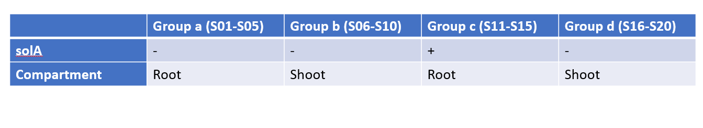

# Introduction
In this file the complete analysis workflow of count data of the tomato RNAseq experiment is shown.

## Goal

The goal of this experiment is to unravel the effect of solanoeclepin A on the plant. Solanoeclepin A is applied on tomato seedlings and roots and shoots are harvested separately. The set up of this experiment is summarized in this figure:
```{r include = FALSE}
if ("knitr" %in% installed.packages()){
  library("knitr")
} else {
  install.packages("knitr")
  library("knitr")
}
```
```{r setup, include = FALSE}
knitr::opts_knit$set(root.dir = rprojroot::find_rstudio_root_file())
```
```{r figurename, echo=FALSE, out.width = '90%'}

```

## Setup

Packages necessary:

* Checkpoint
* DESeq2
* dplyr
* tidyr
* tidyverse
* Biostrings
* biomaRt
* biomartr
* clusterProfiler
* tibble
* mixOmics
* vegan
* apeglm
* EnhancedVolcano
* patchwork
* GenomicFeatures

```{r include=FALSE}
#########
# Library
#########
if ("checkpoint" %in% installed.packages()){
  library("checkpoint") # https://cran.r-project.org/web/packages/checkpoint/index.html
} else {
  install.packages("checkpoint")
  suppressPackageStartupMessages(library("checkpoint"))
  suppressPackageStartupMessages(checkpoint("2021-04-20"))  # all packages in your project will be taken from that date.
}
if ("DESeq2" %in% installed.packages()){
  library("DESeq2")
} else {
  BiocManager::install("DESeq2")
  library("DESeq2")
}
if ("dplyr" %in% installed.packages()){
  library("dplyr")
} else {
  install.packages("dplyr")
  library("dplyr")
}
if ("tidyr" %in% installed.packages()){
  library("tidyr")
} else {
  install.packages("tidyr")
  library("tidyr")
}
if ("tidyverse" %in% installed.packages()){
  library("tidyverse")
} else {
  install.packages("tidyverse")
  library("tidyverse")
}
if ("Biostrings" %in% installed.packages()){
  library("Biostrings") 
} else {
  BiocManager::install("Biostrings")
  library("Biostrings")
}
if ("biomaRt" %in% installed.packages()){
  library("biomaRt") 
} else {
  BiocManager::install("biomaRt")
  library("biomaRt")
}
if ("biomartr" %in% installed.packages()){
  library("biomartr")
} else {
  install.packages("biomartr", dependencies = TRUE)
  library("biomartr")
}
if ("clusterProfiler" %in% installed.packages()){
  library("clusterProfiler") 
} else {
  BiocManager::install("clusterProfiler")
  library("clusterProfiler")
}
if ("tibble" %in% installed.packages()){
  library("tibble") 
} else {
  install.packages("tibble")
  library("tibble")
}
if ("mixOmics" %in% installed.packages()){
  library("mixOmics") 
} else {
  BiocManager::install("mixOmics")
  library("mixOmics")
}
if ("vegan" %in% installed.packages()){
  library("vegan") 
} else {
  install.packages("vegan")
  library("vegan")
}
if ("apeglm" %in% installed.packages()){
  library("apeglm") 
} else {
  BiocManager::install("apeglm")
  library("apeglm")
}
if ("EnhancedVolcano" %in% installed.packages()){
  library("EnhancedVolcano") 
} else {
  BiocManager::install("EnhancedVolcano")
  library("EnhancedVolcano")
}
if ("patchwork" %in% installed.packages()){
  library("patchwork") 
} else {
  BiocManager::install("patchwork")
  library("patchwork")
}
if ("reshape" %in% installed.packages()){
  library("reshape") 
} else {
  install.packages("reshape")
  library("reshape")
}
if ("pheatmap" %in% installed.packages()){
  library("pheatmap") 
} else {
  BiocManager::install("pheatmap")
  library("pheatmap")
}
if ("GenomicFeatures" %in% installed.packages()){
  library("GenomicFeatures") 
} else {
  BiocManager::install("GenomicFeatures")
  library("GenomicFeatures")
}
```

# Mapping results

Calculate the average unique mapping %:

```{r}
ms <- read.csv("Sly1/input/mapping_summary.csv")
ms <- ms[, -1] %>% column_to_rownames("attribute")
ms[1:10,1:3]
```

```{r include = FALSE}
unique <- ms[9,]
unique <- as.list(unique)
unique <- gsub("%", "", unique)
unique <- as.numeric(unique)
uniquepercent <- mean(unique)
```
```{r}
uniquepercent
```

The average unique mapping % is 45.51%. This is low, but explained by the type of library prep method that was used (Moll et al, 2014).


# PCA analysis

Plot PCA to see if samples with the same treatments cluster together.
```{r message=FALSE, warning=FALSE}
source("Sly1/scripts/create_pca_plot.R")
p1 <- plot_pca(plantpart = c("root", "shoot"), pca_colour = "treatment")
p2 <- plot_pca(plantpart = c("root", "shoot"), pca_colour = "compartment")
p1 + p2
```

On PC1, the compartments cluster together. There is no clear clustering based on solA treatment. Let's check PC3 and PC4.
```{r message=FALSE, warning=FALSE}
p1 <- plot_pca(plantpart = c("root", "shoot"), pc_x_axis = "PC3", pc_y_axis = "PC4", pca_colour = "treatment")
p2 <- plot_pca(plantpart = c("root", "shoot"), pc_x_axis = "PC3", pc_y_axis = "PC4", pca_colour = "compartment")
p1 + p2
```

Also no good separation. Let's plot the screeplot:
```{r message=FALSE, warning=FALSE}
source("Sly1/scripts/scree_plot.R")
plot_scree(comp = c("root","shoot"))
```

It would be more informative to look at the compartments individually.
```{r message=FALSE, warning=FALSE}
p1 <- plot_pca(plantpart = c("shoot"), pc_x_axis = "PC1", pc_y_axis = "PC2", pca_colour = "treatment") + ggtitle("shoot")
p2 <- plot_pca(plantpart = c("root"), pc_x_axis = "PC1", pc_y_axis = "PC2", pca_colour = "treatment") + ggtitle("root")
p3 <- plot_pca(plantpart = c("shoot"), pc_x_axis = "PC3", pc_y_axis = "PC4", pca_colour = "treatment") +ggtitle("shoot")
p4 <- plot_pca(plantpart = c("root"), pc_x_axis = "PC3", pc_y_axis = "PC4", pca_colour = "treatment") + ggtitle("root")
(p1 + p2) / (p3 + p4)
```
```{r message=FALSE, warning=FALSE}
p1 <- plot_pca(plantpart = c("shoot"), pc_x_axis = "PC5", pc_y_axis = "PC6", pca_colour = "treatment") + ggtitle("shoot")
p2 <- plot_pca(plantpart = c("root"), pc_x_axis = "PC5", pc_y_axis = "PC6", pca_colour = "treatment") + ggtitle("root")
p1 + p2
```

```{r}
plot_pca(plantpart = c("root"), pc_x_axis = "PC1", pc_y_axis = "PC5", pca_colour = "treatment") + ggtitle("root")
```
In root, there seems to be solA separation in PC5, in shoot, clustering based on solA treatment is difficult to observe. But since the treatment is applied on the roots, this might not be so surprising.

Check the screeplots for separate compartment PCA:
```{r message=FALSE, warning=FALSE}
p1 <- plot_scree(comp = "shoot") + ggtitle("Shoot")
p2 <- plot_scree(comp = "root") + ggtitle("Root")
p1 + p2
```
## PLS-DA analysis

We can try to see if supervised clustering analysis gives us better results. We will use PLS-DA and the package mixOmics.
First find the optimal number of components with the performance check from mixOmics:

```{r message=FALSE, warning=FALSE}
source("Sly1/scripts/perf_plsda.R")
do_plsda_perf(plantpart = c("root","shoot"), n = 99) #this takes some time
```
From this, we infer that the ideal number of components is x. We need this as input for plotting the PLS-DA.
Now we can plot the PLS-DA plot:
```{r message=FALSE, warning=FALSE}
source("Sly1/scripts/plsda.R")
do_plsda(plantpart = c("root","shoot"), nc = 2, ttl = "All tomato samples PLS-DA")
```

This separation is much better.

But within compartments we might find more clear results.

```{r message=FALSE, warning=FALSE}
do_plsda_perf(plantpart = "shoot", n = 99)
do_plsda(plantpart = "shoot", nc = 2, ttl = "Shoot samples PLS-DA")

do_plsda_perf(plantpart = "root", n = 99)
do_plsda(plantpart = "root", nc = 4, ttl = "Root samples PLS-DA")


```

# DEG analysis

## Wald test

Use design formula ~ compartment + treatment
```{r message=FALSE, warning=FALSE}
source("Sly1/scripts/volcanoplot.R")
```
```{r, warning = FALSE, message = FALSE}
make_volcanoplot(plantpart = c("root","shoot"), log2FC_threshold = 0, FCcutoff_volcano = 1, padj_threshold = 0.05, ttl = "All treatments, solA treatment, Wald", method = "compartment+treatment")
```

There is only 1 DEG.

Again, it makes more sense to look within compartments.
```{r, warning = FALSE, message = FALSE}
make_volcanoplot(plantpart = c("shoot"), log2FC_threshold = 0, FCcutoff_volcano = 1, padj_threshold = 0.05, ttl = "Shoot, solA treatment, Wald", method = "treatment")
make_volcanoplot(plantpart = c("root"), log2FC_threshold = 0, FCcutoff_volcano = 1, padj_threshold = 0.05, ttl = "Root, solA treatment, Wald", method = "treatment")
```

Indeed, there are several DEGs in both compartments.

## Heatmaps

Since there is only 1 DEG if we take into account all samples at the same time, it is not possible to make a heatmap in that way. Therefore, we only use within compartment DEGs, add those together, and produce a heatmap.

```{r message=FALSE, warning=FALSE}
source("Sly1/scripts/get_filtered_list_of_DEGs.R")
xs <- get_list_of_DEGs(plantpart = "shoot", method = "treatment", log2FC_threshold = 0)
xs <- xs %>% rownames_to_column("genes")
xr <- get_list_of_DEGs(plantpart = "root", method = "treatment", log2FC_threshold = 0)
xr <- xr %>% rownames_to_column("genes")
```
So in the shoot there are 43 DEGs and in the root 22 DEGs.

```{r message=FALSE, warning=FALSE}
xrr <- xr %>% rownames_to_column("transcripts") 
xrr <- xrr$transcripts
xss <- xs %>% rownames_to_column("transcripts")
xss <- xss$transcripts
length(xss[xss %in% xss])
```

None of the DEGs of root and shoot overlap; they are all different.

```{r message=FALSE, warning=FALSE}
x <- rbind(xs, xr)
source("Sly1/scripts/produce_scaled_counts_matrix.R")
y <- produce_scaled_counts_matrix() %>% column_to_rownames("sample") %>% t() %>% as.data.frame() %>% rownames_to_column("genes")
DEG_counts <- left_join(x, y, by="genes") 
DEG_counts <- DEG_counts[, -c(2,3,4,5,6,7)]
DEG_counts <- DEG_counts %>% column_to_rownames("genes")
xp_design <- xp_design %>% column_to_rownames("sample")

pheatmap(DEG_counts,
         gaps_col = c(5,10,15),
         cluster_rows = TRUE,                      
         cluster_cols = TRUE, 
         show_rownames = FALSE, 
         show_colnames = TRUE,
         scale = "row",
         main = "All samples; clustered")
```

In this heatmap, samples from the same treatment cluster together, which is good. Also, samples from the same compartment cluster together. There is more differences visible between samples the shoot than between samples of root, which is expected since shoot resulted in more DEGs.
Let's look more into the root samples and see whether they cluster together based on only their DEGs.
```{r message=FALSE, warning=FALSE}
x <- get_list_of_DEGs(plantpart = "root", method = "treatment", log2FC_threshold = 0)
x <- x %>% rownames_to_column("genes")

y <- filter_counts_based_on_compartment(comprtmt = "root") %>% t() %>% as.data.frame() %>% rownames_to_column("genes")
DEG_counts <- left_join(x, y, by="genes") 
DEG_counts <- DEG_counts[, -c(2,3,4,5,6,7)]
DEG_counts <- DEG_counts %>% column_to_rownames("genes")
xp_design <- xp_design %>% column_to_rownames("sample")

pheatmap(DEG_counts,
         gaps_col = 5,
         cluster_rows = TRUE,                      
         cluster_cols = TRUE, 
         show_rownames = FALSE, 
         show_colnames = TRUE,
         scale = "row",
         main = "Root samples; clustered")

```

Indeed the samples from the same treatment cluster together.

## LRT

Compare Wald test with LRT test, which checks the null-model with the full model.
First for the complete tomato dataset.
```{r message=FALSE, warning=FALSE}
source("Sly1/scripts/compare_Wald_vs_LRT.R")
compare_wald_vs_LRT(compartment = c("root","shoot"), method = "compartment+treatment")
```

This is a confirmation that there are no overlapping DEGs betwen compartments induced by solA treatment.
Check also the within compartment comparisons:
```{r message=FALSE, warning=FALSE}
compare_wald_vs_LRT(compartment = "root", method = "treatment")

compare_wald_vs_LRT(compartment = "shoot", method = "treatment")
```

For the root, LRT gives less (15) DEGs than Wald (22), but all of the LRT genes overlap with Wald. For the shoot, LRT gives 23 DEGs and Wald 43, again all of the LRT DEGs overlap with Wald. This is a reasonable confirmation of our DEGs.

# Annotation of DEGs

To infer the function of solA on tomato, we have to infer the function of the DEGs.
Since looking at the complete dataset hardly gives us DEGs, we only look at yes/no solA within the compartments.
```{r message=FALSE, warning=FALSE}
source("Sly1/scripts/get_annotated_DEGs.R")
DEGroot <- get_annotated_DEGs(plantpart = "root", method = "treatment", name = "Sly1/output/annotated_DEGs_root.csv")
DEGshoot <- get_annotated_DEGs(plantpart = "shoot", method = "treatment", name = "Sly1/output/annotated_DEGs_shoot.csv")
DEGroot$compartment <- rep("root", count(DEGroot))
DEGshoot$compartment <- rep("shoot", count(DEGshoot))
DEGSly <- rbind(DEGroot, DEGshoot)
DEGSly$original_genename <- substr(DEGSly$original_genename, start = 6, stop = 23)
uniquepaste <- function(x) { paste(unique(x), sep = ',', collapse = ",") }
DEGSly <- aggregate(DEGSly, by = list(DEGSly$original_genename, DEGSly$compartment), FUN = uniquepaste)
write_delim(DEGSly, "Sly1/output/allDEGs.csv", delim = ";")
```

Using AgriGO (bioinfo.cau.edu.cn/agriGO/analysis.php), no enriched GO terms are detected for any of the sets of DEGs, neither when taking the DEGs from root and shoot separately nor when combining them.